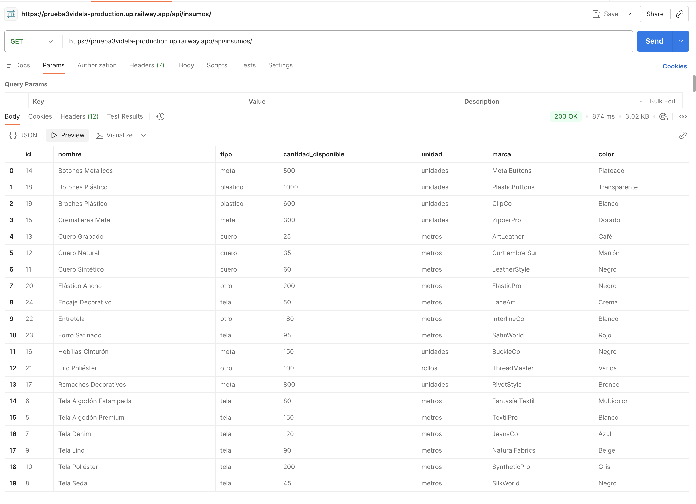
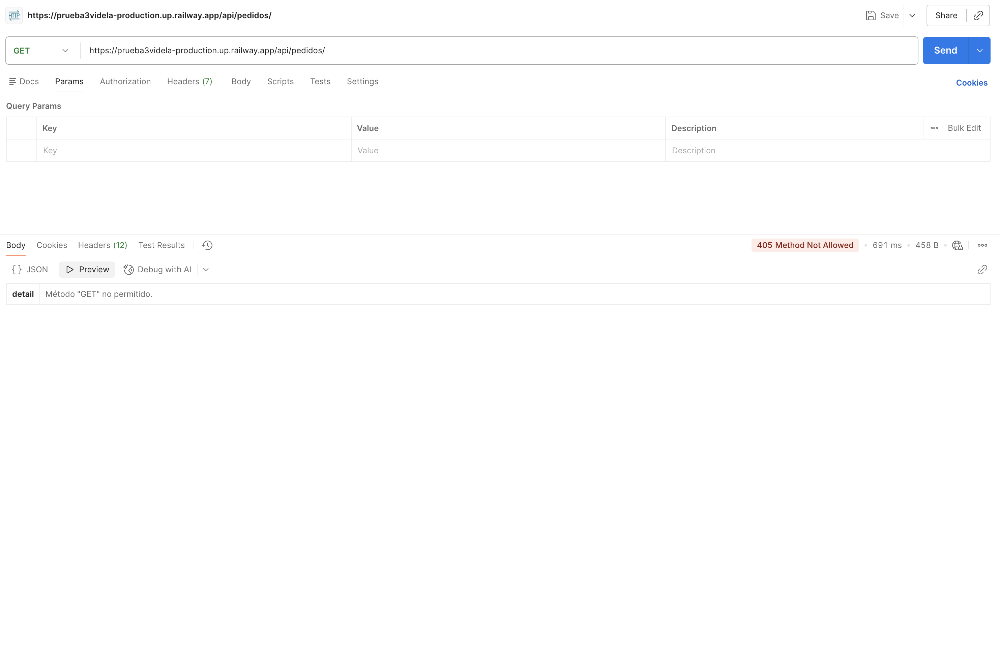
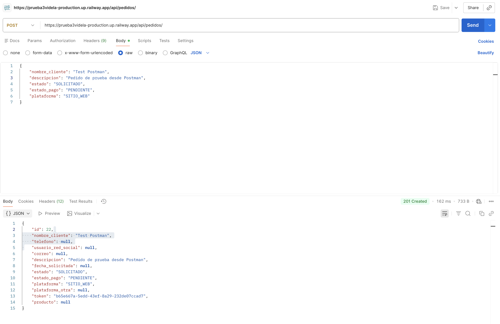
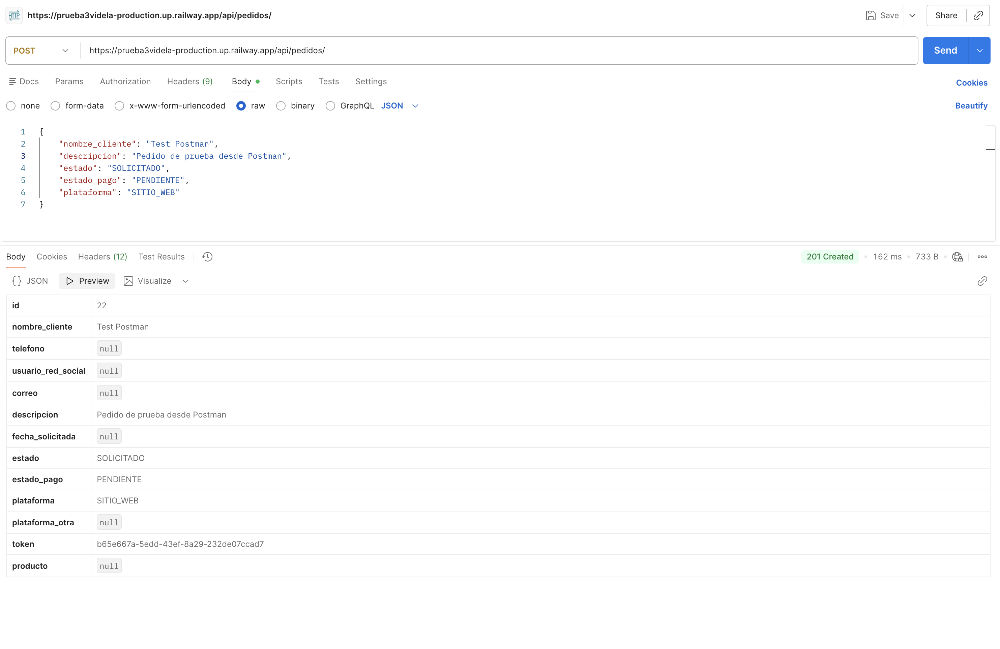
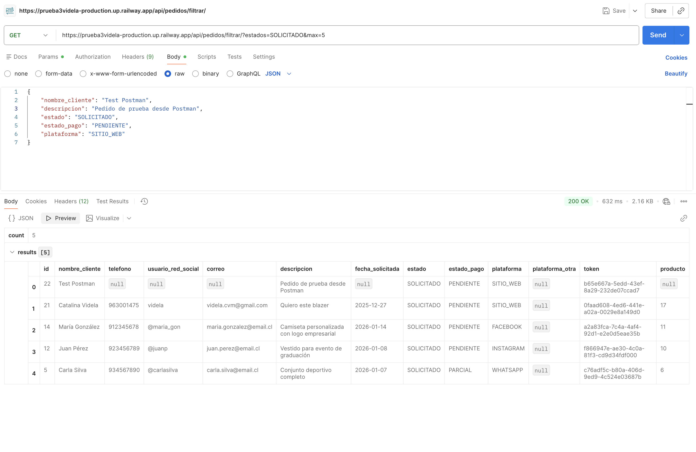
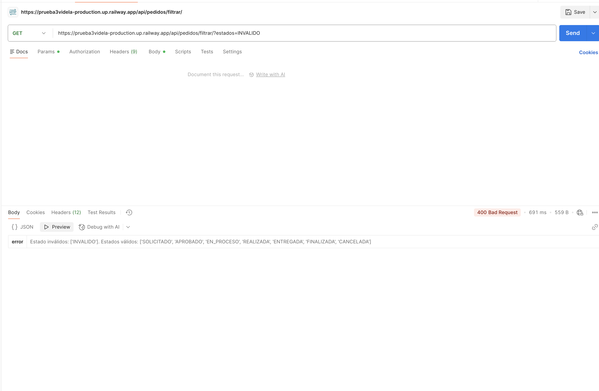
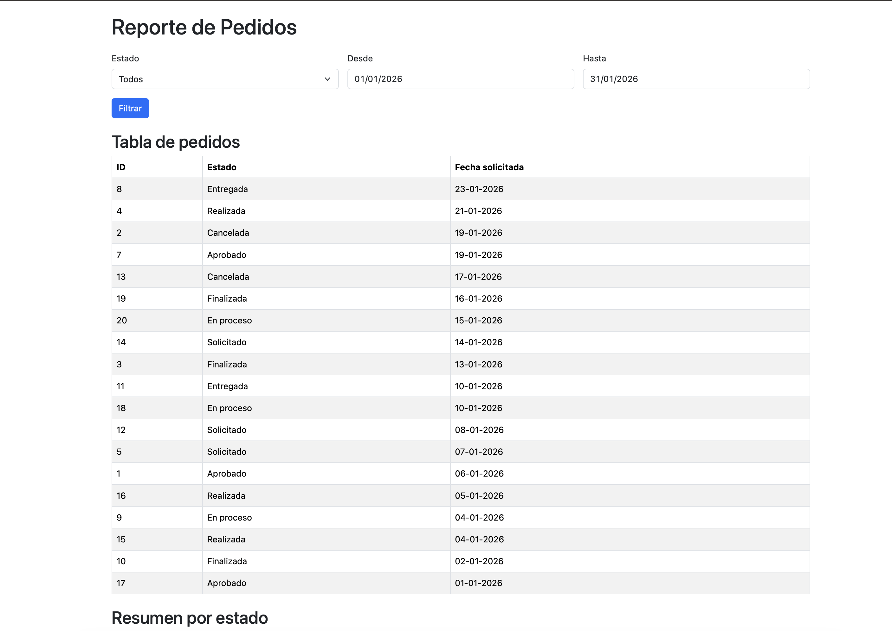
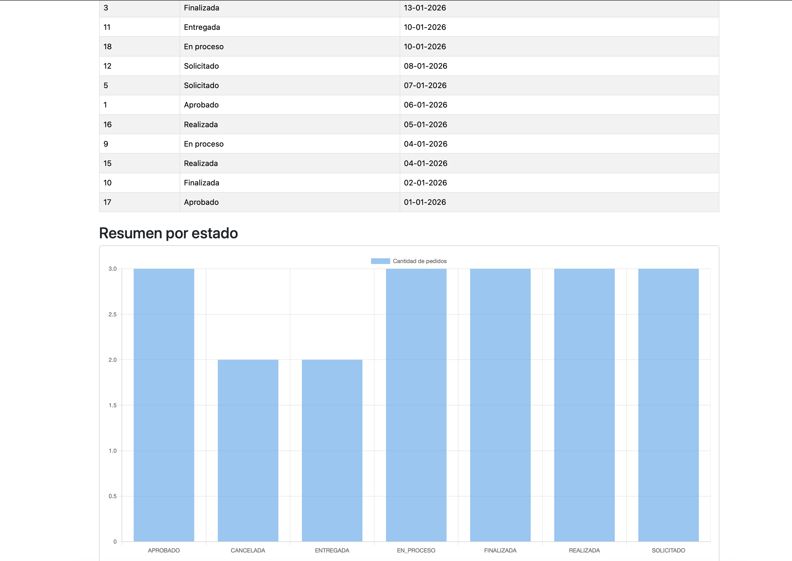
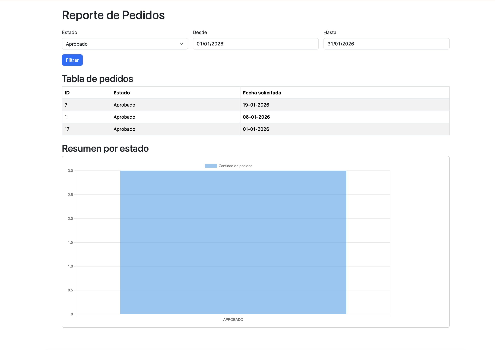
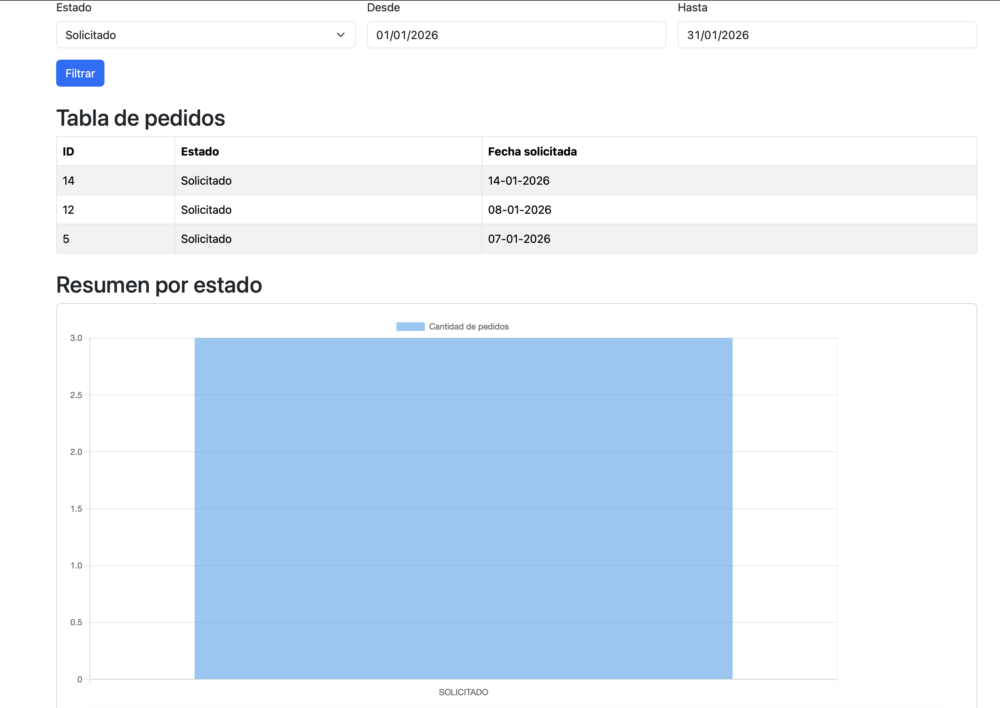

# Tienda de Artículos Personalizados

Proyecto Django para catálogo de productos público y administración de pedidos personalizados.

---

## Evaluación Sumativa N°4 - Tienda Online con API y Deploy

### URL de Producción
https://prueba3videla-production.up.railway.app

### Credenciales de acceso
- Usuario: `admin`
- Contraseña: `admin`

---

## Requisitos
- Python 3.13.0
- Django 5.2.7
- Pillow 11.3.0
- djangorestframework 3.14.0

---

## Instalación Local

1. Clona el repositorio:
```bash
git clone https://github.com/felipevidela/PRUEBA_3_VIDELA.git
cd PRUEBA_3_VIDELA
```

2. Instala las dependencias:
```bash
python3 -m pip install -r requirements.txt
```

3. Ejecuta el servidor:
```bash
python3 manage.py runserver
```

4. Accede a:
   - Sitio público: http://127.0.0.1:8000/
   - Admin: http://127.0.0.1:8000/admin/
   - Reporte: http://127.0.0.1:8000/reporte/pedidos/

**Nota:** La base de datos (`db.sqlite3`) está incluida con datos de prueba precargados (categorías, productos, insumos y pedidos). No es necesario ejecutar migraciones.

---

## Instrucciones de Deploy (Railway)

### Requisitos previos
- Cuenta en [Railway](https://railway.app)
- Repositorio en GitHub

### Pasos para deploy

1. **Conectar repositorio a Railway:**
   - Ir a https://railway.app y crear nuevo proyecto
   - Seleccionar "Deploy from GitHub repo"
   - Autorizar y seleccionar el repositorio

2. **Configurar variables de entorno en Railway:**
   - `DJANGO_SECRET_KEY`: clave secreta para producción
   - `DEBUG`: False (ya configurado por defecto)
   **Nota de seguridad:** En un entorno de producción real, se debe configuar la variable `DJANGO_SECRET_KEY`con una clave única y secreta. El proyecto un clave por defecto para que sea fácil para evaluar por el profesor, pero no es recomendado para aplicaciones en producción. 

3. **Configurar comando de inicio:**
   - En Railway: Settings > Deploy > Custom Start Command
   - Escribir: `gunicorn PRUEBA_3_VIDELA.wsgi`

4. **Generar dominio público:**
   - En Settings > Domains > Generate Domain

**Nota:** La base de datos está incluida en el repositorio con datos de prueba.

---

## Endpoints API

### API 1 - CRUD Insumos
**Ruta:** `/api/insumos/`

| Método | Endpoint | Descripción |
|--------|----------|-------------|
| GET | `/api/insumos/` | Listar todos los insumos |
| POST | `/api/insumos/` | Crear nuevo insumo |
| GET | `/api/insumos/{id}/` | Ver detalle de un insumo |
| PUT | `/api/insumos/{id}/` | Modificar insumo completo |
| PATCH | `/api/insumos/{id}/` | Modificar insumo parcial |
| DELETE | `/api/insumos/{id}/` | Eliminar insumo |

**Ejemplo - Listar insumos:**
```bash
curl https://prueba3videla-production.up.railway.app/api/insumos/
```

**Ejemplo - Crear insumo:**
```bash
curl -X POST https://prueba3videla-production.up.railway.app/api/insumos/ \
  -H "Content-Type: application/json" \
  -d '{"nombre":"Tela Nueva","tipo":"tela","cantidad_disponible":100,"unidad":"metros","marca":"MarcaX","color":"azul"}'
```

---

### API 2 - Crear y Modificar Pedidos
**Ruta:** `/api/pedidos/`

| Método | Endpoint | Descripción |
|--------|----------|-------------|
| POST | `/api/pedidos/` | Crear nuevo pedido |
| PUT | `/api/pedidos/{id}/` | Modificar pedido completo |
| PATCH | `/api/pedidos/{id}/` | Modificar pedido parcial |

**Nota:** GET (listar) y DELETE están bloqueados por diseño.

**Ejemplo - Crear pedido:**
```bash
curl -X POST https://prueba3videla-production.up.railway.app/api/pedidos/ \
  -H "Content-Type: application/json" \
  -d '{"nombre_cliente":"Juan Pérez","descripcion":"Pedido de prueba","estado":"SOLICITADO","estado_pago":"PENDIENTE","plataforma":"SITIO_WEB"}'
```

**Ejemplo - Modificar estado de pedido:**
```bash
curl -X PATCH https://prueba3videla-production.up.railway.app/api/pedidos/1/ \
  -H "Content-Type: application/json" \
  -d '{"estado":"APROBADO"}'
```

---

### API 3 - Filtrar Pedidos
**Ruta:** `/api/pedidos/filtrar/`

| Parámetro | Tipo | Descripción |
|-----------|------|-------------|
| desde | fecha | Fecha inicio (YYYY-MM-DD) |
| hasta | fecha | Fecha fin (YYYY-MM-DD) |
| estados | texto | Estados separados por coma |
| max | entero | Máximo de resultados (1-200) |

**Ejemplo - Filtrar por fechas:**
```bash
curl "https://prueba3videla-production.up.railway.app/api/pedidos/filtrar/?desde=2025-01-01&hasta=2025-12-31"
```

**Ejemplo - Filtrar por estado:**
```bash
curl "https://prueba3videla-production.up.railway.app/api/pedidos/filtrar/?estados=SOLICITADO,APROBADO"
```

**Ejemplo - Filtro combinado:**
```bash
curl "https://prueba3videla-production.up.railway.app/api/pedidos/filtrar/?desde=2025-01-01&estados=SOLICITADO&max=5"
```

---

## Evidencias Postman

### API 1 - GET Insumos (200 OK)


### API 2 - GET Pedidos bloqueado (405 Method Not Allowed)


### API 2 - POST Crear Pedido (201 Created)



### API 3 - GET Filtrar Pedidos (200 OK)


### API 3 - Validación de estado inválido (400 Bad Request)
**URL:** `/api/pedidos/filtrar/?estados=INVALIDO`
La API valida que los estados existan y retorna error 400 si no son válidos.



---
## Report del Sistema 

**URL:** https://prueba3videla-production.up.railway.app/reporte/pedidos/ 

### Accesos al reporte 
1. Ir a la URL del reporte 
2. Iniciar sesión con las credenciales de admin: 
- Usuario: `admin`
- Contraseña: `admin`
3. Una vez ingresado, verás el reporte con:
- Filtros por estado y rango de fechas 
- Tabla de pedidos 
- Gráfico de barras por estado 

### Funcionalidades del reporte 
- **Filtro por estado:** Selecciona un estado específico (Solicitado, Aprobado, En proceso, etc.)
- **Filtro por fechas:** Define un rango con fecha desde/hasta
- **Tabla:** Muestra los peddios filtrados con ID, estado y fecha
- **Gráfico:** Visualización de cantidad de pedidos por estado (se usa Chart.js)

---

## Evidencias Reporte del Sistema

### Reporte general - Parte 1


### Reporte general - Parte 2


### Reporte filtrado por estado "Aprobado"


### Reporte filtrado por estado "Solicitado"


---

## Estructura del Proyecto
```
PRUEBA_3_VIDELA/
├── appTienda/           # Modelos, vistas, forms, urls
├── templates/           # HTML público y admin
├── media/               # Imágenes subidas (productos/pedidos)
├── evidencias/          # Capturas de Postman y reportes
├── db.sqlite3           # Base de datos con datos de prueba
└── requirements.txt     # Dependencias del proyecto
```
